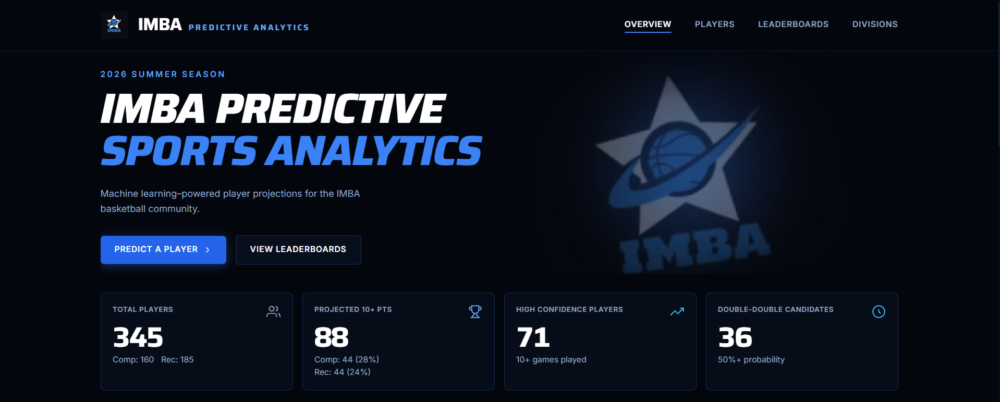
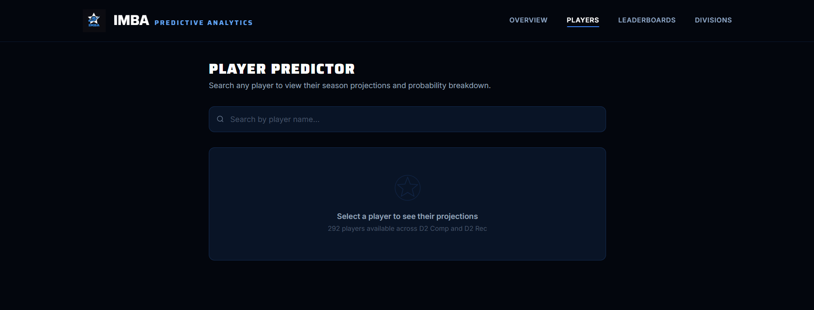
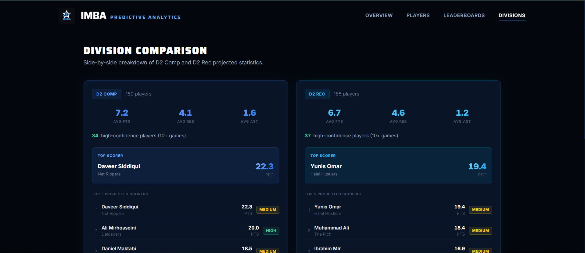
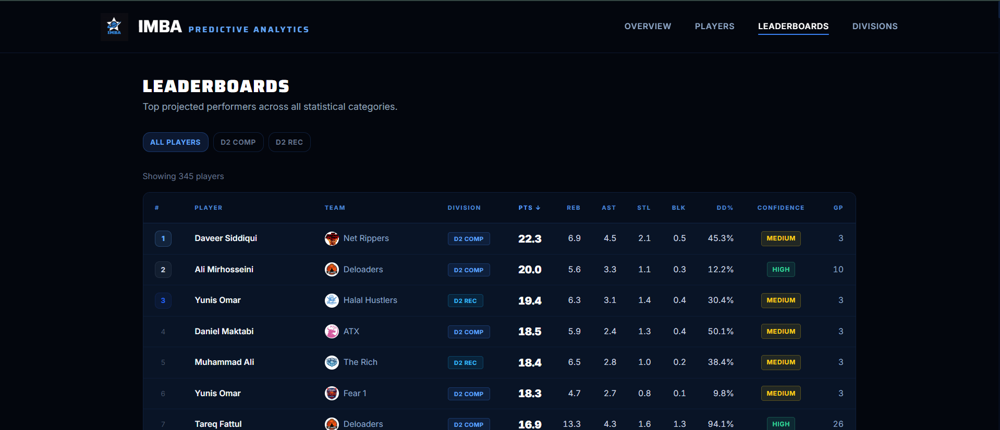

# IMBA Predictive Sports Analytics Platform

**Live Demo:** [https://imba-predictive-sports-analytics-pl.vercel.app/](https://imba-predictive-sports-analytics-pl.vercel.app/)

<br />


---

## Overview

An end-to-end sports analytics platform built on historical **IMBA basketball league** data. The platform trains machine learning models to predict player performance for the upcoming season and surfaces those predictions through a modern, interactive web dashboard — giving coaches, players, and fans data-driven league insights at a glance.

The pipeline spans the full data science lifecycle: web scraping → cleaning → feature engineering → model training → prediction generation → interactive frontend deployment.

---

## Features

- **📊 Performance Dashboard** — League-wide KPI cards, top projected scorers, and featured player projections all in one view
- **🏀 Player Predictions** — Per-player stat projections (PTS, REB, AST, STL, BLK) with confidence scoring and prediction ranges
- **🏆 Leaderboards** — Sortable, filterable rankings across every statistical category
- **📐 Division Analytics** — Side-by-side D2 Comp and D2 Rec breakdown with division-level insights
- **🔍 Player Search** — Instant fuzzy search with per-player division toggles and full stat cards
- **🎯 Probability Models** — Threshold predictions for 10+, 15+, and 20+ point games, double-double likelihood, and more
- **⚡ Responsive UI** — Mobile-first design with a dark sports-analytics aesthetic

---

## Tech Stack

### Frontend
| Technology | Purpose |
|---|---|
| [Next.js 15](https://nextjs.org/) (App Router) | React framework with server components and static export |
| [TypeScript](https://www.typescriptlang.org/) | Type-safe component and data layer |
| [Tailwind CSS](https://tailwindcss.com/) | Utility-first styling with custom design tokens |

### Data Science & Machine Learning
| Technology | Purpose |
|---|---|
| [Python 3.11](https://www.python.org/) | Pipeline orchestration and model training |
| [Pandas](https://pandas.pydata.org/) | Data cleaning, aggregation, and feature engineering |
| [NumPy](https://numpy.org/) | Numerical computation |
| [scikit-learn](https://scikit-learn.org/) | Regression and classification model training |
| [Matplotlib / Seaborn](https://seaborn.pydata.org/) | EDA and model evaluation visualizations |
| [BeautifulSoup / Selenium](https://www.selenium.dev/) | Web scraping from imbaonline.com |
| [Jupyter](https://jupyter.org/) | Exploratory data analysis notebooks |

### Deployment
| Technology | Purpose |
|---|---|
| [Vercel](https://vercel.com/) | Frontend hosting and CI/CD |
| [GitHub](https://github.com/) | Version control and source of truth |

---

## Project Structure

```
IMBA-Predictive-Sports-Analytics-Platform/
│
├── frontend/                   # Next.js web application
│   ├── src/
│   │   ├── app/                # Pages (/, /players, /leaderboards, /divisions)
│   │   ├── components/         # Reusable UI components
│   │   └── lib/                # Utilities, types, and data helpers
│   └── public/
│       ├── data/               # Pre-generated prediction JSON served to the frontend
│       └── team-logos/         # IMBA team logo assets
│
├── src/                        # Python data pipeline
│   ├── scraper.py              # Scrapes player/game stats from imbaonline.com
│   ├── clean_data.py           # Cleans and standardizes raw data
│   ├── feature_engineering.py  # Builds model-ready feature sets
│   ├── train_model.py          # Trains and serializes ML models
│   ├── predict.py              # Generates predictions using saved models
│   └── generate_current_predictions.py  # Exports final JSON for the frontend
│
├── models/                     # Serialized trained model artifacts (.pkl)
│
├── data/
│   ├── raw/                    # Original scraped data (unmodified)
│   └── processed/              # Cleaned, feature-engineered CSVs and predictions
│
├── notebooks/                  # Jupyter notebooks for EDA and experimentation
│
├── app/
│   └── streamlit_app.py        # Legacy Streamlit prototype dashboard
│
├── reports/
│   ├── figures/                # EDA plots and model evaluation charts
│   └── *.csv                   # Exported leaderboard and prediction reports
│
└── requirements.txt
```

---

## Machine Learning Models

All models are trained on historical IMBA game-log data and serialized to `models/`. Each model is re-applied each season to generate fresh predictions.

### Regression Models — Projected Stats
| Model | Target | File |
|---|---|---|
| Points Prediction | Projected points per game | `pts_model.pkl` |
| Rebounds Prediction | Projected rebounds per game | `reb_model.pkl` |
| Assists Prediction | Projected assists per game | `ast_model.pkl` |
| Steals Prediction | Projected steals per game | `stl_model.pkl` |
| Blocks Prediction | Projected blocks per game | `blk_model.pkl` |

### Classification Models — Performance Thresholds
| Model | Target | File |
|---|---|---|
| 10+ Points | Probability of scoring 10 or more | `pts_10_plus_model.pkl` |
| 15+ Points | Probability of scoring 15 or more | `pts_15_plus_model.pkl` |
| 20+ Points | Probability of scoring 20 or more | `pts_20_plus_model.pkl` |
| Double-Double | Probability of a double-double game | `double_double_model.pkl` |
| 5+ Rebounds | Probability of grabbing 5 or more rebounds | `reb_5_plus_model.pkl` |
| 10+ Rebounds | Probability of grabbing 10 or more rebounds | `reb_10_plus_model.pkl` |
| 5+ Assists | Probability of dishing 5 or more assists | `ast_5_plus_model.pkl` |

### Confidence Scoring
Each player projection is assigned a **High / Medium / Low** confidence tier based on games played history and model prediction variance, surfaced throughout the UI via color-coded badges.

---

## Data Pipeline

```
imbaonline.com
      │
      ▼
 scraper.py          ← Selenium/BeautifulSoup web scraping
      │
      ▼
 clean_data.py       ← Normalize, deduplicate, handle missing values
      │
      ▼
 feature_engineering.py  ← Rolling averages, per-game rates, tier features
      │
      ▼
 train_model.py      ← Train regression + classification models, serialize .pkl
      │
      ▼
 generate_current_predictions.py  ← Apply models to current roster → JSON
      │
      ▼
 frontend/public/data/  ← Served statically by Next.js
```

---

## Screenshots

### Home Dashboard
> *KPI cards, top projected scorers, and featured player spotlight cards*



### Player Predictions
> *Per-player stat projections, confidence ratings, and division toggle*



### Division Analytics
> *Side-by-side D2 Comp vs D2 Rec breakdown with sortable leaderboards*



### Leaderboards
> *Sortable rankings across PTS, REB, AST, STL, BLK, DD% and more*



---

## Setup & Development

### Prerequisites
- Node.js 18+
- Python 3.11+

### Frontend

```bash
cd frontend
npm install
npm run dev        # http://localhost:3000
```

### Python Pipeline

```bash
pip install -r requirements.txt

python src/scraper.py                       # 1. Scrape data
python src/clean_data.py                    # 2. Clean
python src/feature_engineering.py           # 3. Engineer features
python src/train_model.py                   # 4. Train models
python src/generate_current_predictions.py  # 5. Export predictions
```

---

## Future Enhancements

- **Team-level prediction models** — Win probability and point differential forecasting
- **Season-over-season analysis** — Year-by-year trend comparisons and career trajectory charts
- **Advanced analytics** — True Shooting %, usage rate, and efficiency metrics
- **Automated data refresh** — Scheduled pipeline to pull live game results and re-score predictions mid-season
- **Player comparison tool** — Side-by-side stat and projection comparisons
- **Mobile app** — React Native companion app for live game-night stats

---

## Author

**Muhammad Moghal**  
Data Science Student  
The University of Texas at Dallas

[](https://linkedin.com/in/muhammadmmoghal)
[](mailto:muhammadmmoghal@gmail.com)

---

<p align="center">Built with data, code, and basketball 🏀</p>
